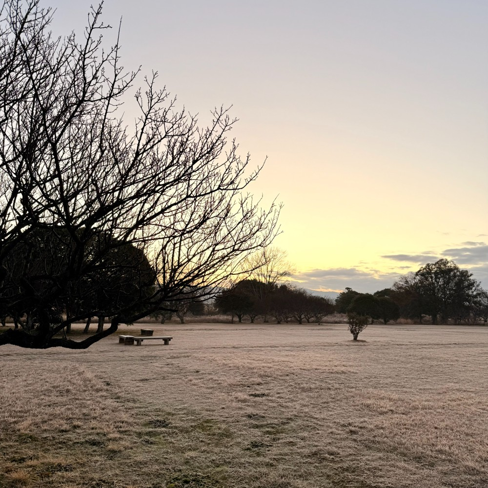

朝勉勤続166日目。　今朝の奈良盆地は霜が降りて清々し。歩む速さに応じてほっぺたや耳に風を感じるのが心地良い。マジ。よーし、今日は時間があるかぎり過去問を中心にごりごりやってくぞー！

 

一次試験まであと211日

#朝活 #資格勉強 #中小企業診断士

 

━━━━━━━━━━━━━━━

 

この年末年始、旅行や宿泊費が高くなってるけど、好奇心を物価高で諦めたくないものだ。（41句点）

 

[#春秋要約](https://x.com/hashtag/%E6%98%A5%E7%A7%8B%E8%A6%81%E7%B4%84?src=hashtag_click) [#sjyouyaku](https://x.com/hashtag/sjyouyaku?src=hashtag_click)

 

  

#春秋要約