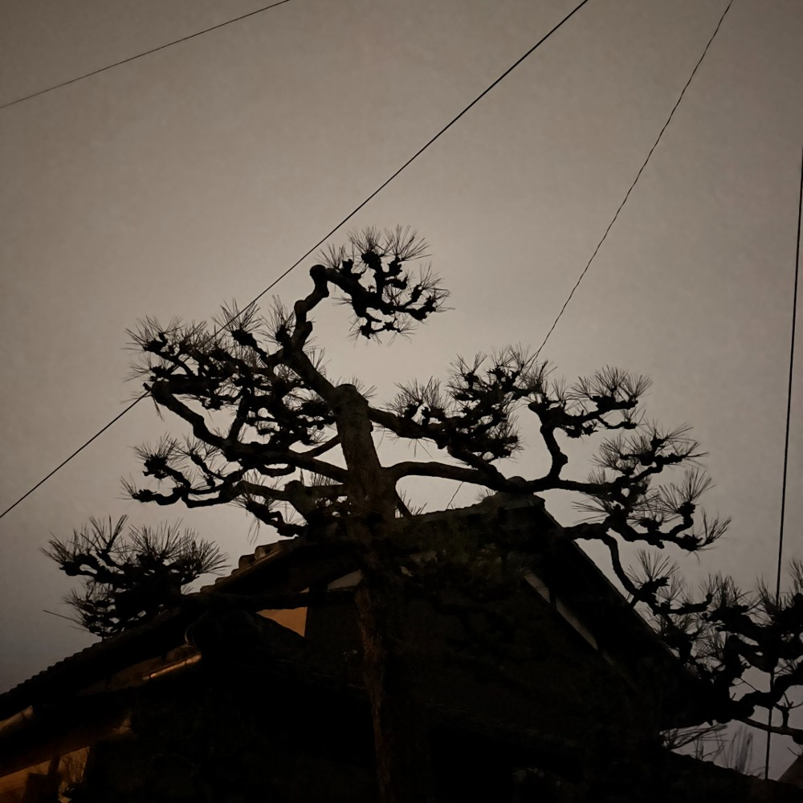

## 朝勉勤続172日目。

外の雲が低くやけに静かだ。勉強中は静かすぎると逆に気が散るので、Spotifyで鳥のさえずりが聞こえる森の音や波の音を流しっぱなしにしてみたら、けっこういい感じ。さて、ラジオ体操しますかーめっちゃ寒いけど行く。

 

さんぶー！奈っ良盆地に降る雪も〜♪って歌詞が脳裏をよぎる、さむー！！！

 

一次試験まであと205日

#朝勉 #朝活 #資格勉強 #中小企業診断士

\--

 

善意の行動がためらわれるようになったが、賢治の詩を思い出し、新たな方途を探りたい。（41句点）

 

#春秋要約 #sjyouyaku #中小企業診断士

 

  

#春秋要約