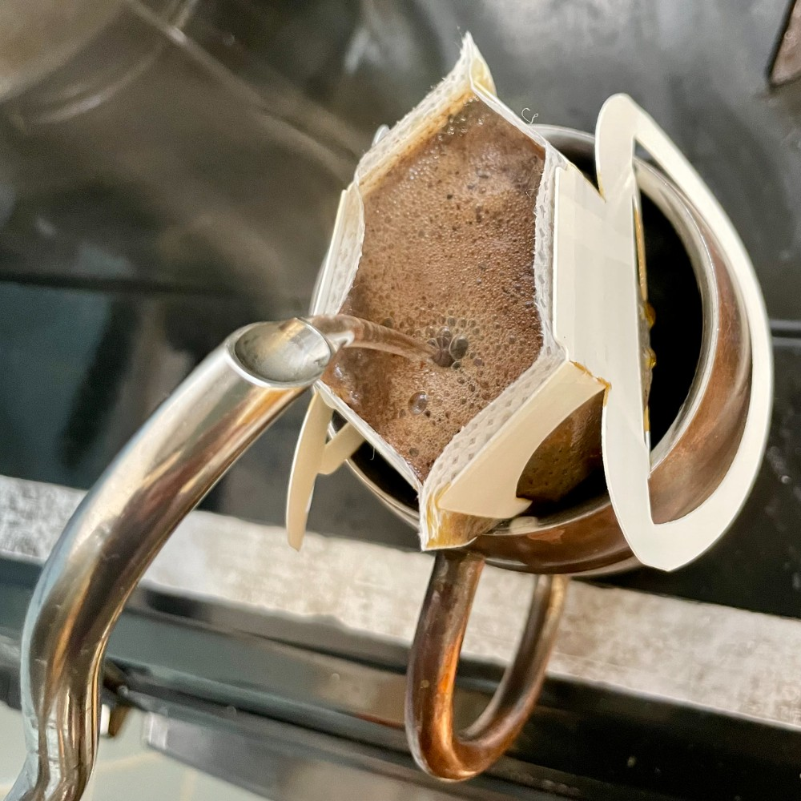

## 朝勉勤続173日目。

外気温マイナス3度で盆地は激冷え、布団から抜け出す瞬間は辛く、湯が湧くまでの時間がやたら長く感じてしまったが、ひとまず体を温めてしまえば、いつも通りの静かな朝だ。今日も勉強に仕事に時間を大事にしてこ〜♨︎

 

一次試験まであと204日

#朝勉 #朝活 #資格勉強 #中小企業診断士

\--

パナマ運河が再び危機。気候変動による水不足は一国支配ではなく国際協調が求められる。（41句点）  

 

#春秋要約 #sjyouyaku #中小企業診断士

 

