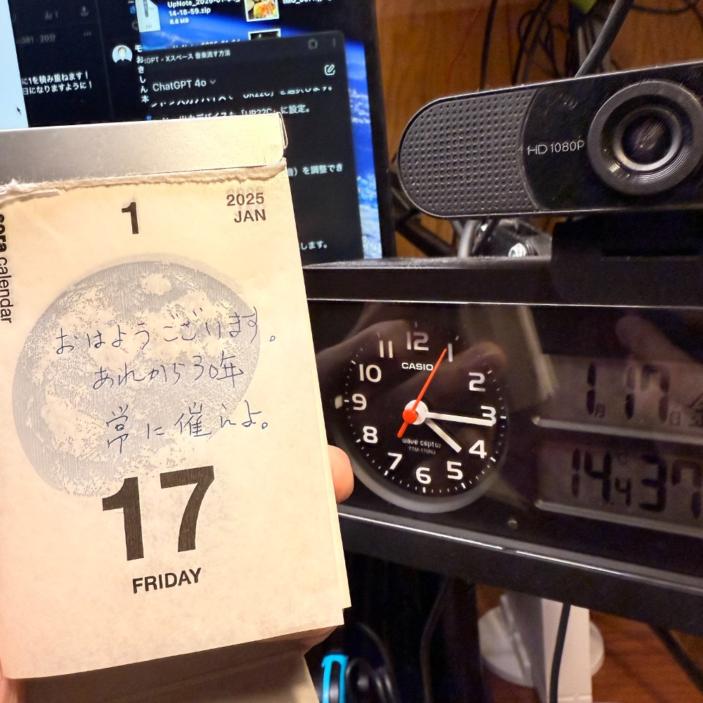

## 朝勉勤続180日目。

あれから30年。日々、学んだ事を忘れないよう勉強してるが、人は忘れられるから生きていけるとも言う。ただ、忘れたくても忘れられないのは辛い。だから、「よりそう」気持ちがすべてだと思おう。うん、今日も大事にしよう。。

 

一次試験まであと197日

#朝勉 #朝活 #中小企業診断士試験

 

\--

阪神大震災から今日で30年、世代が入れ替わるも災禍の記憶が褪せないように備えたい。（41句点）

 

#春秋要約 #sjyouyaku #中小企業診断士

  

