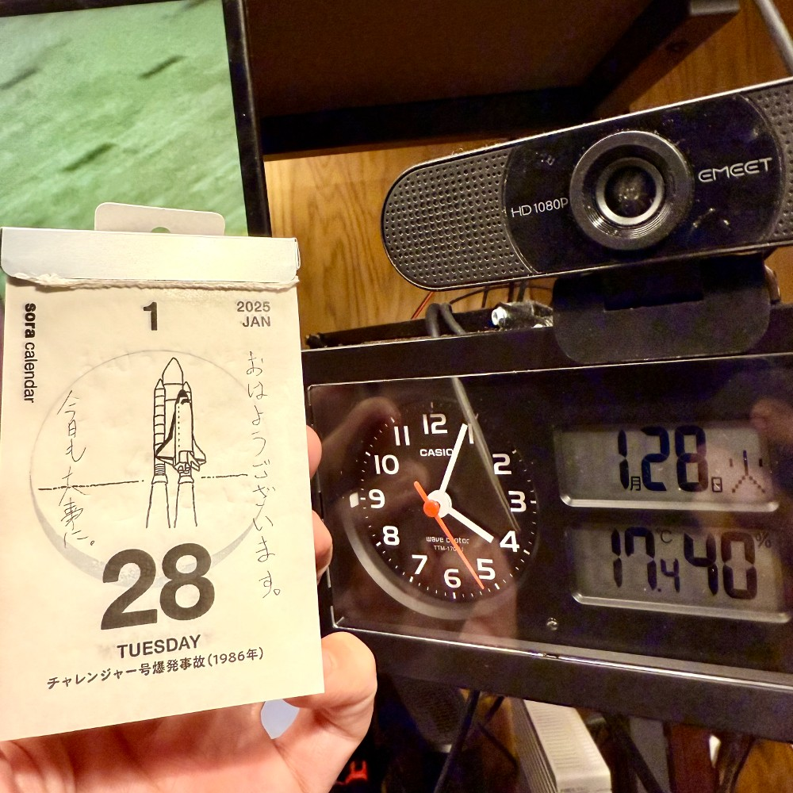

## 朝勉勤続191日目。

22時前には寝て4時前に「腹が減った！」と目覚めるのは、健全と言えるのだろうかよくわからんけど、お昼に食べすぎると眠たくなるので、朝にモリモリ食べるようにしてる。おでんご飯！後でまた家族と食べる〜笑

 

一次試験まであと187日

#朝勉 #朝活 #中小企業診断士試験 #日進月歩

  

\--

戦争体験を元にした失敗の本質や教訓話を、従軍経験のないリーダーがどう生かすか宿題。（41句点）

 

#春秋要約 #sjyouyaku #中小企業診断士

  

  

