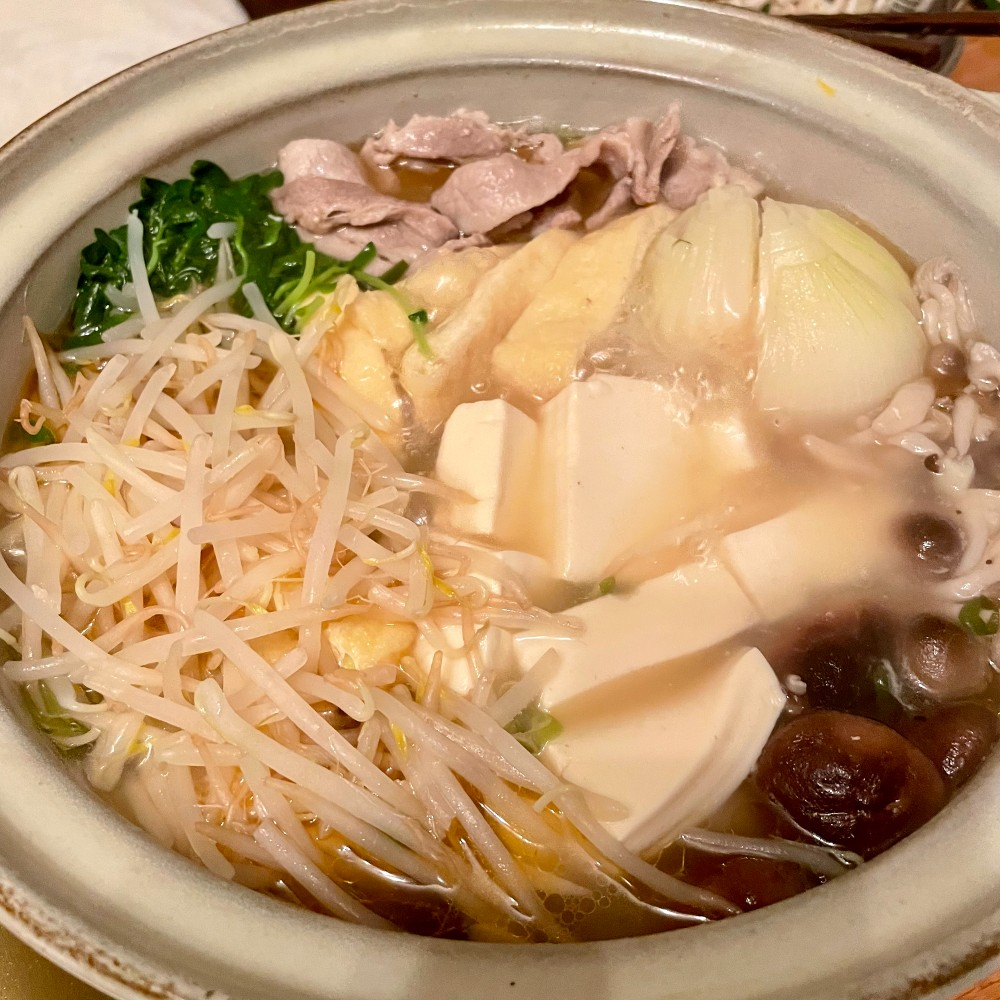
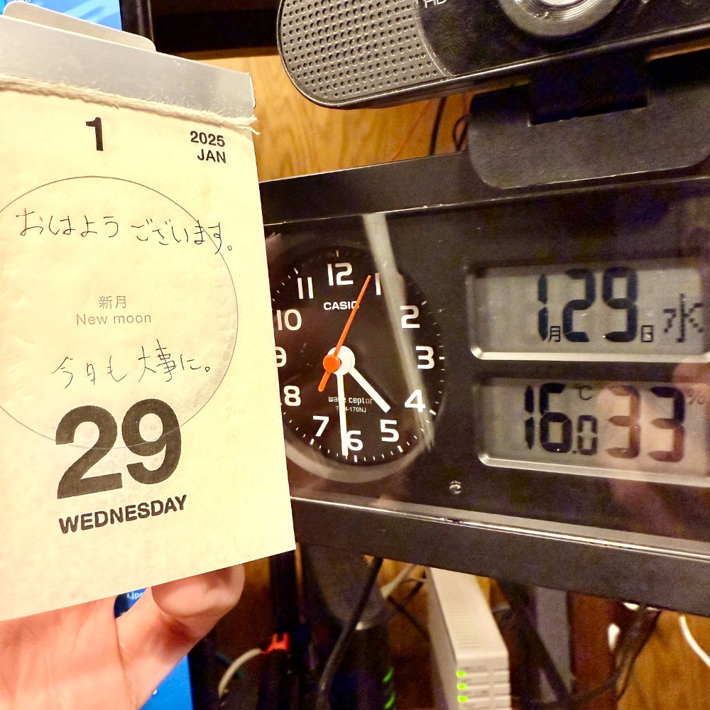

## 朝勉勤続192日目。

常夜鍋を頂きながら新聞。新興生成AI「DeepSeek」の登場は、競争原理的には歓迎。しかし、米中摩擦が過熱するのは心配だ。もう日本人はラテン化すべきだと説いた森永卓郎さんの訃報に驚いた。どうか安らかに。

 

一次試験まであと186日

#朝勉 #朝活 #中小企業診断士試験 #日進月歩

  

\--

誠意って何かね。私利私欲な考えや邪な考えに満ちたテレビ業界の体質への視線は厳しい。（41句点）

 

#春秋要約 #sjyouyaku #中小企業診断士

  

