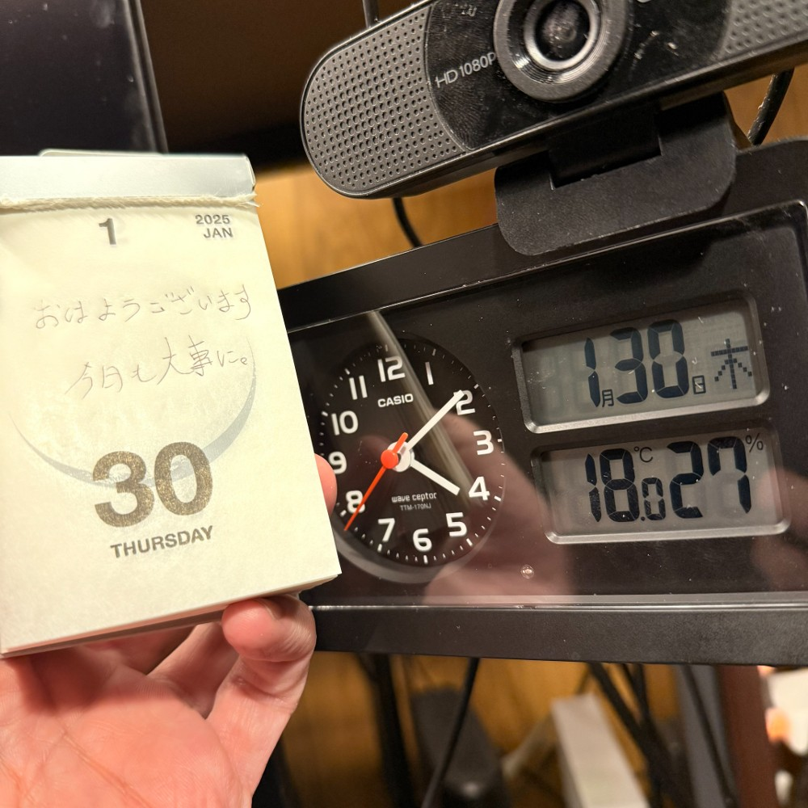

## 朝勉勤続193日目。

正直に言う。今朝は勉強サボりました！しかし、この半年毎日欠かさずやってきたし、これからも「勤めて」やっていくことに変わらない云々かんぬん濁。この甘さと隙（スキ）で泣くことにならないようにせねば苦笑汗だわ〜ひえ〜

 

一次試験まであと185日

#朝勉 #朝活 #中小企業診断士試験 #日進月歩

  

\--

「戦争は発明の母」と言うと物騒だったが、半導体がらみの角逐で「発明は戦争の母」か。（41句点）

 

#春秋要約 #sjyouyaku #中小企業診断士

  

