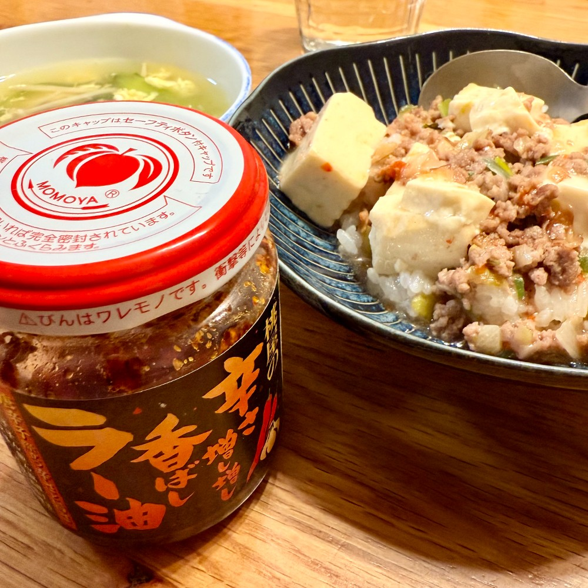
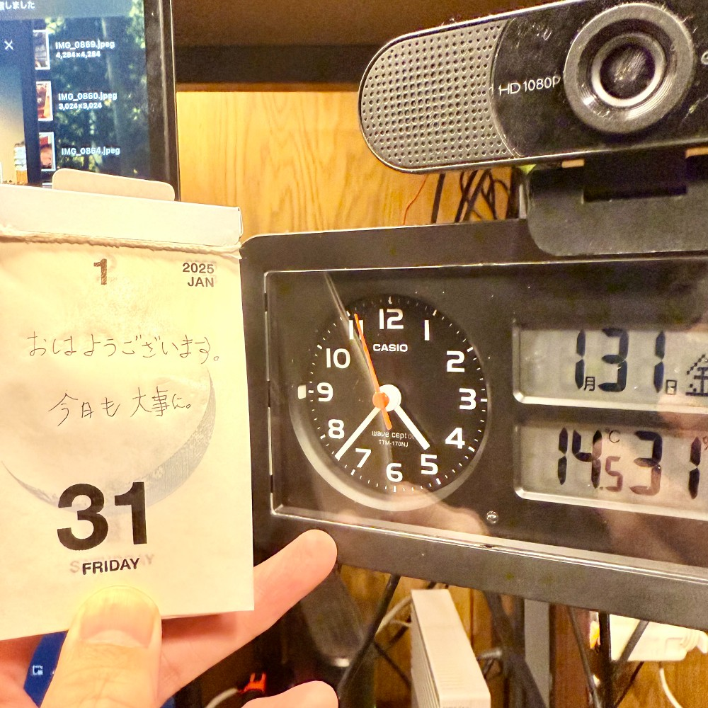

## 朝勉勤続194日目。

a2025/02/02 6:26講義動画と問題集を1セット終わらせて、腹が減ったので朝から麻婆豆腐に「食べるラー油」で気合いマシマシ！これ、今さらだけどマイブームでカレーに入れたり、サラダや白ご飯にもぶっかけたりしてる〜うまい笑

 

一次試験まであと184日

#朝勉 #朝活 #中小企業診断士試験 #日進月歩

  

\--

埼玉の陥没事故に水系で育った支え合いの文化を見る。防災庁も原点を見直してはどうか。（41句点）

 

#春秋要約 #sjyouyaku #中小企業診断士

  

  

  

