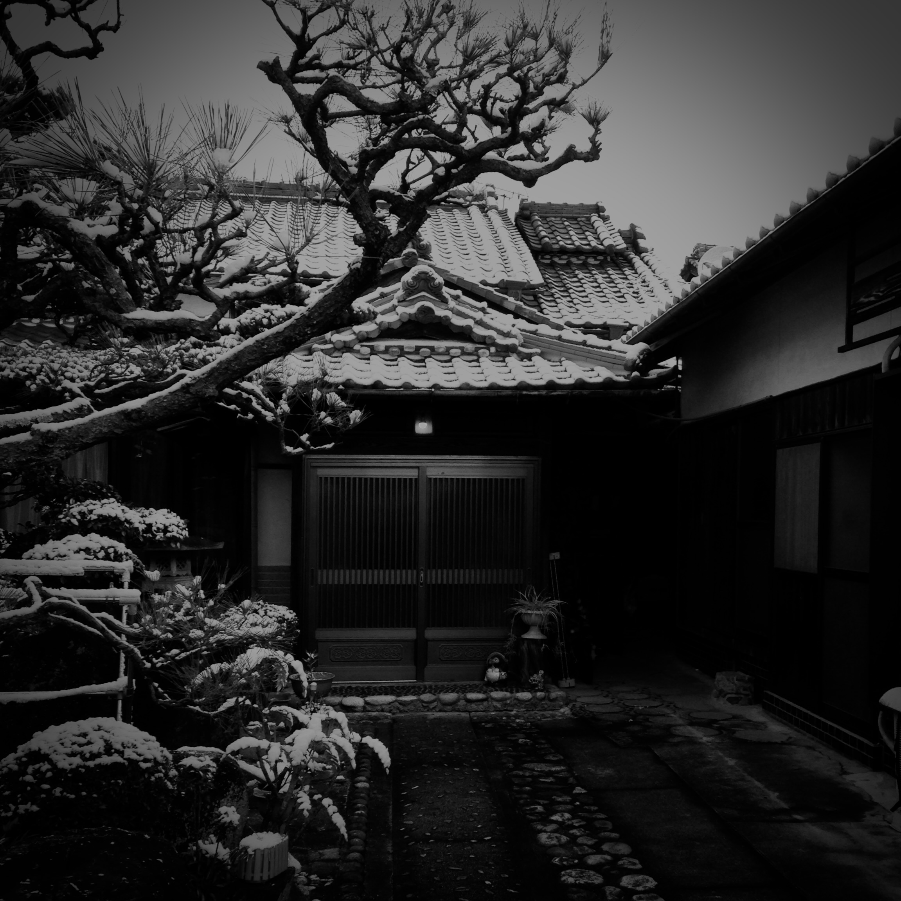
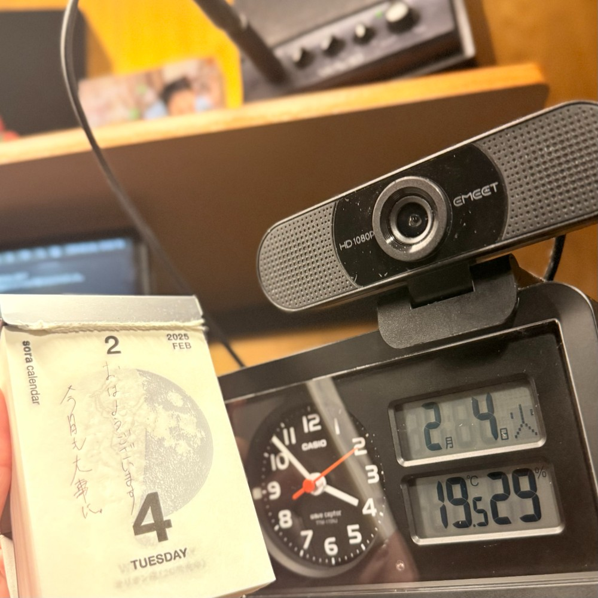

## 朝勉勤続199日目。

外は氷点下でよく冷える朝だが心は温かい。昨日、子の送迎中に「お父さん、暖かい家に帰れるって、それだけでご褒美やな！」と聞いて心の底からうれしかった。よーし、今日も大事に！

 

一次試験まであと178日

#朝勉 #朝活 #中小企業診断士試験 #日進月歩

  

\--

同じ雪でも場所と視線が違えば異なる表情をみせるが、ロシア指導者の根雪は溶かしたい。（41句点）

 

#春秋要約 #sjyouyaku #中小企業診断士

  
