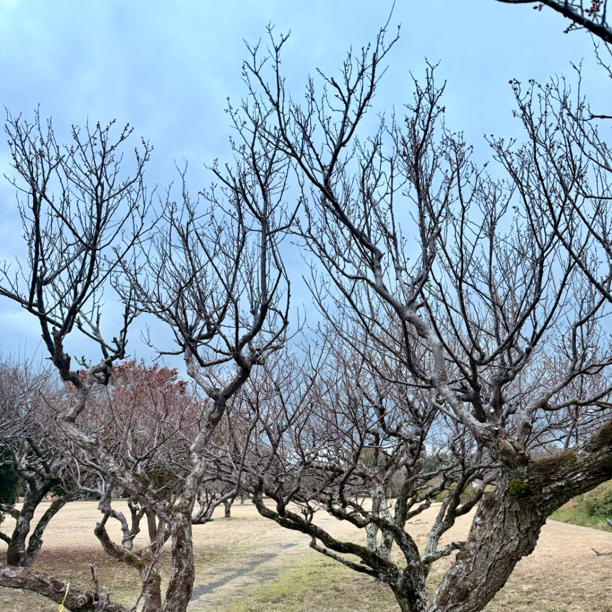
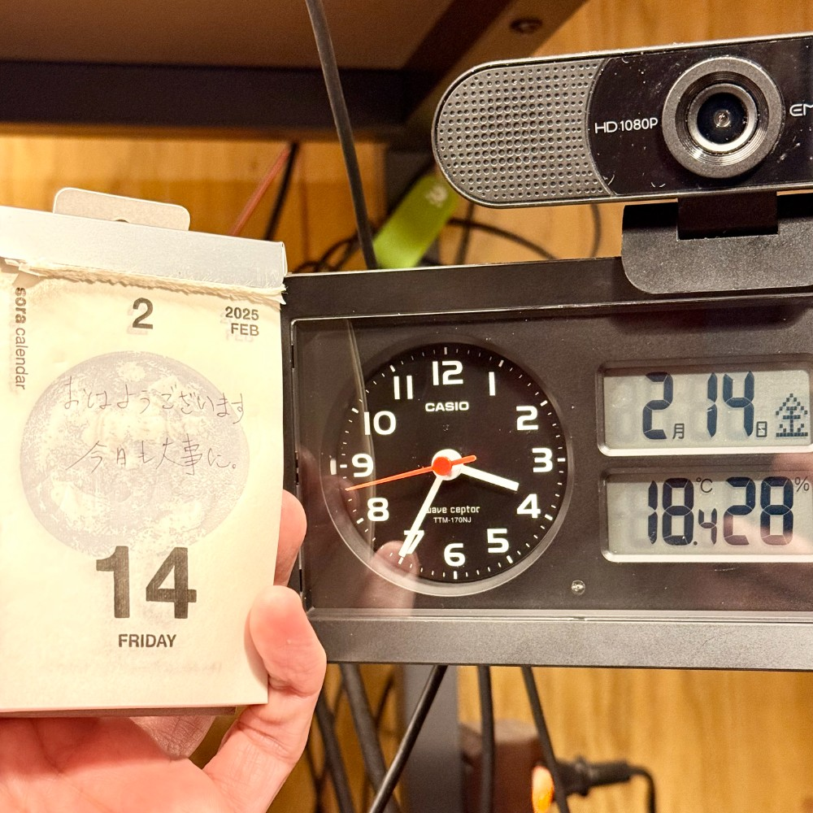

## 朝勉勤続206日目。

年度末が近づくと仕事キツイけど、朝だけはなんとか勉強時間をつくらねば。暖かい春は待ち遠しいが道のりは険しい・・・やれやれ。そういえば、近所の梅はまだまだ実が堅かった、あと2週間ぐらいかな〜

 

一次試験まであと169日

#朝勉 #朝活 #中小企業診断士試験 #日進月歩

  

\--

旧姓使用の拡大は「もどき」だ。根本を改めず、伝統もどきに縛られ時間ばかりが過ぎる（40文字）

 

令和7年2月14日(金)

#春秋要約 #sjyouyaku #中小企業診断士

  

  

  

