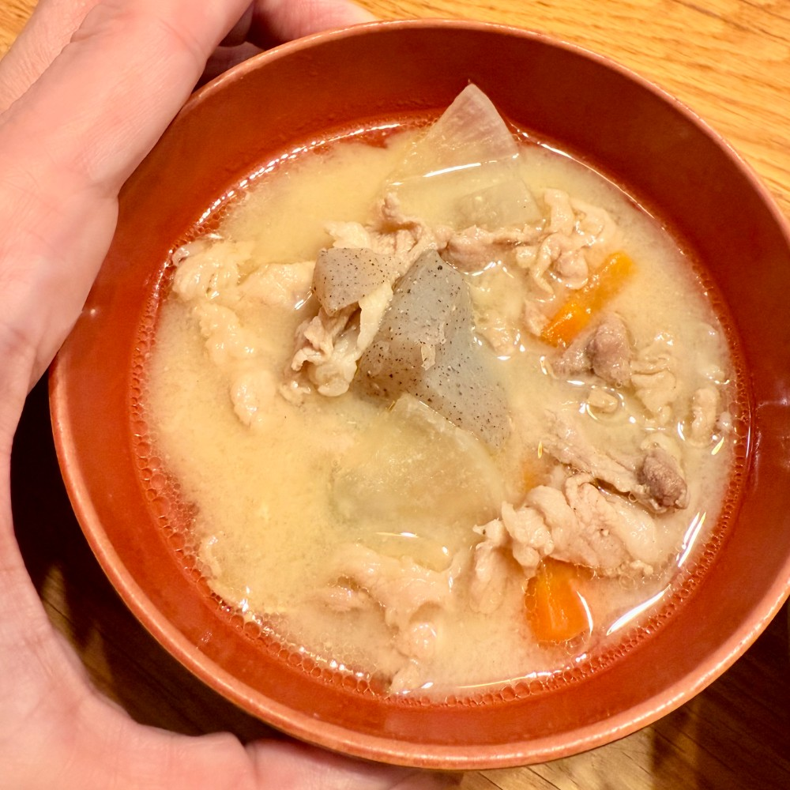
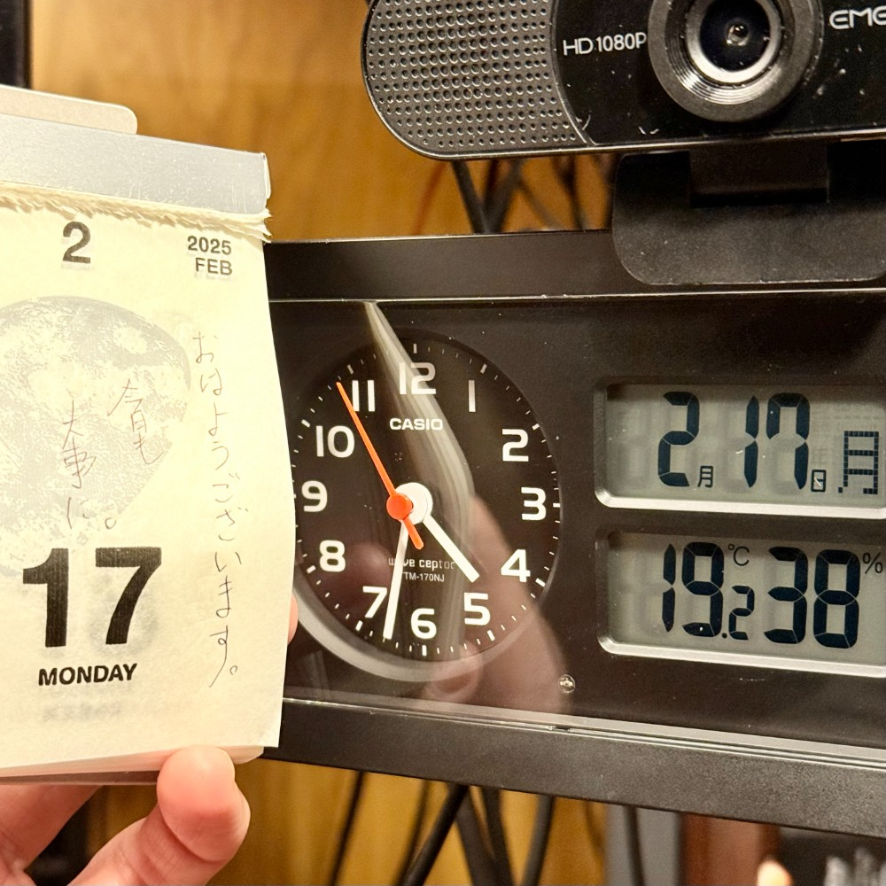

## 朝勉勤続209日目。

いつも通り、ハラヘッタと目覚め布団から脱出し、昨晩に娘氏作の豚汁で身も心も温まって着座。もう2月も半分が過ぎたかと、身を引き締めてがんばろーっ！と気合い入れ直したところ。今週もスタート〜

 

一次試験まであと166日

#朝勉 #朝活 #中小企業診断士試験 #日進月歩

  

\--

逃げることは時に戦うより勇気がいる。非戦を希求する人々を世界は見捨ててはなるまい（40文字）

 

令和7年2月17日(月)

#春秋要約 #sjyouyaku #中小企業診断士

  

  

  

