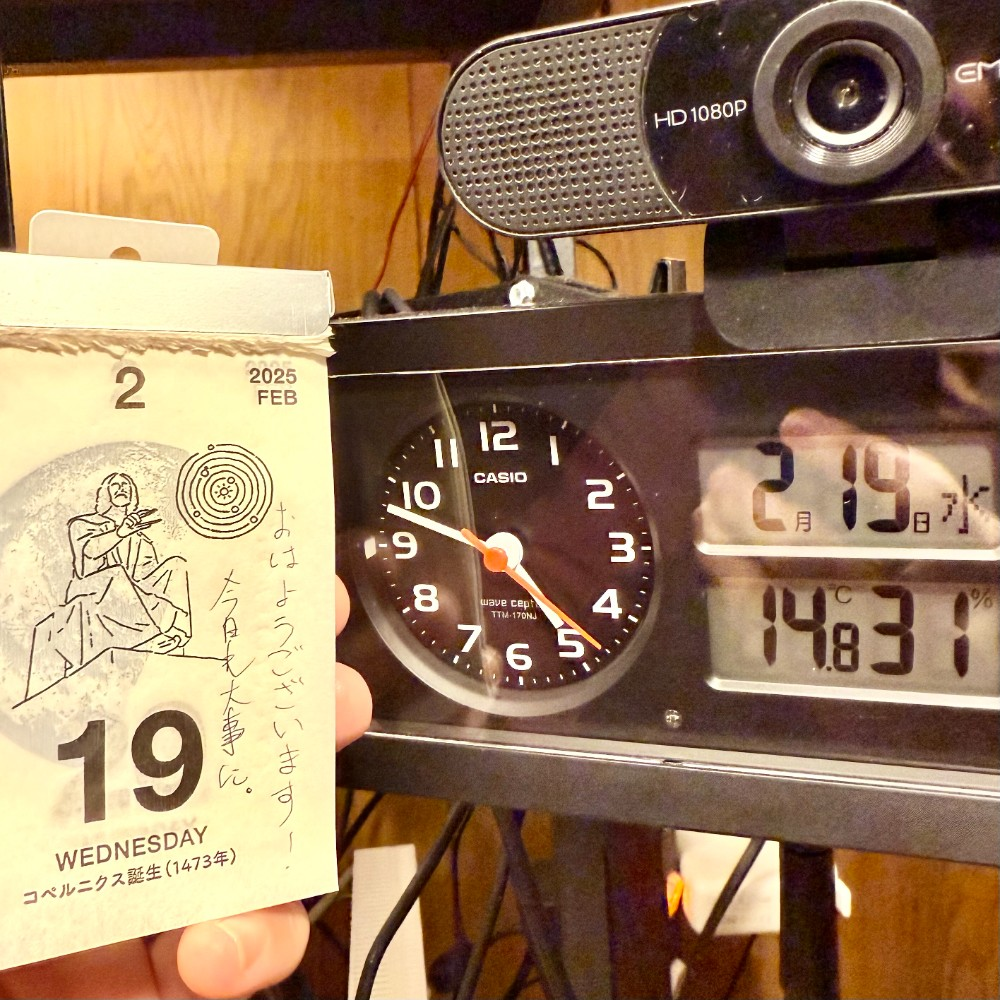

## 朝勉勤続211日目。

2周目の学習もやっとこ折り返し地点に到達。しかし、全く覚えてなさすぎて道のりは険しい・・・やってる感で満足してしまってそうで早朝からケツ引っぱたいてるとこ。地道にゴリゴリやるしかねーけどなぁ〜汗笑

 

一次試験まであと164日

#朝勉 #朝活 #中小企業診断士試験 #日進月歩

  

\--

「103万円の壁」で与野党の折衝が難航するも、その帳尻合わせの様は滑稽にも見える。（41句点）

 

令和7年2月19日(水)

#春秋要約 #sjyouyaku #中小企業診断士

  

