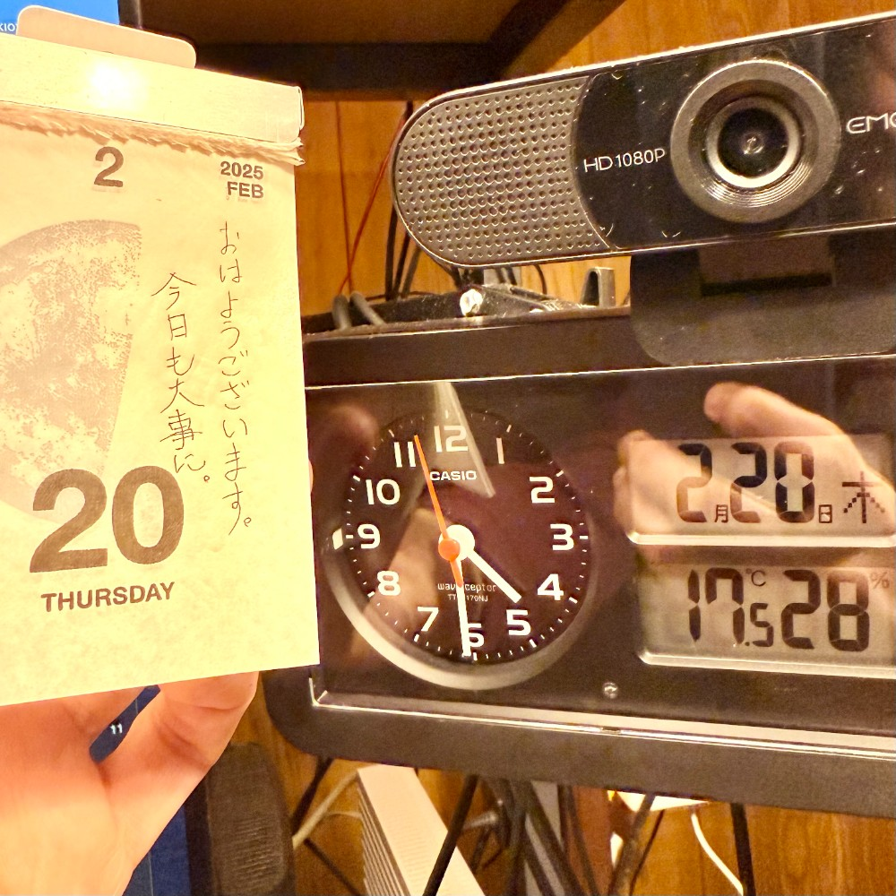

## 朝勉勤続212日目。

エアコンをあえて低めの温度で着けっぱなしにしてたけど、それでも寒くて温かいお茶で手を温めながら勉強。予報では週末いっぱいまで我慢かー、年度末のバタバタなんとか春まで乗り切らねばネバネバぁ

 

一次試験まであと163日

#朝勉 #朝活 #中小企業診断士試験 #日進月歩

  

\--

トイザらスのひな人形が人気なのも、米国流の圧力の影響だが、したたかに向き合いたい。（41句点）

 

令和7年2月20日(木)

#春秋要約 #sjyouyaku #中小企業診断士

  

