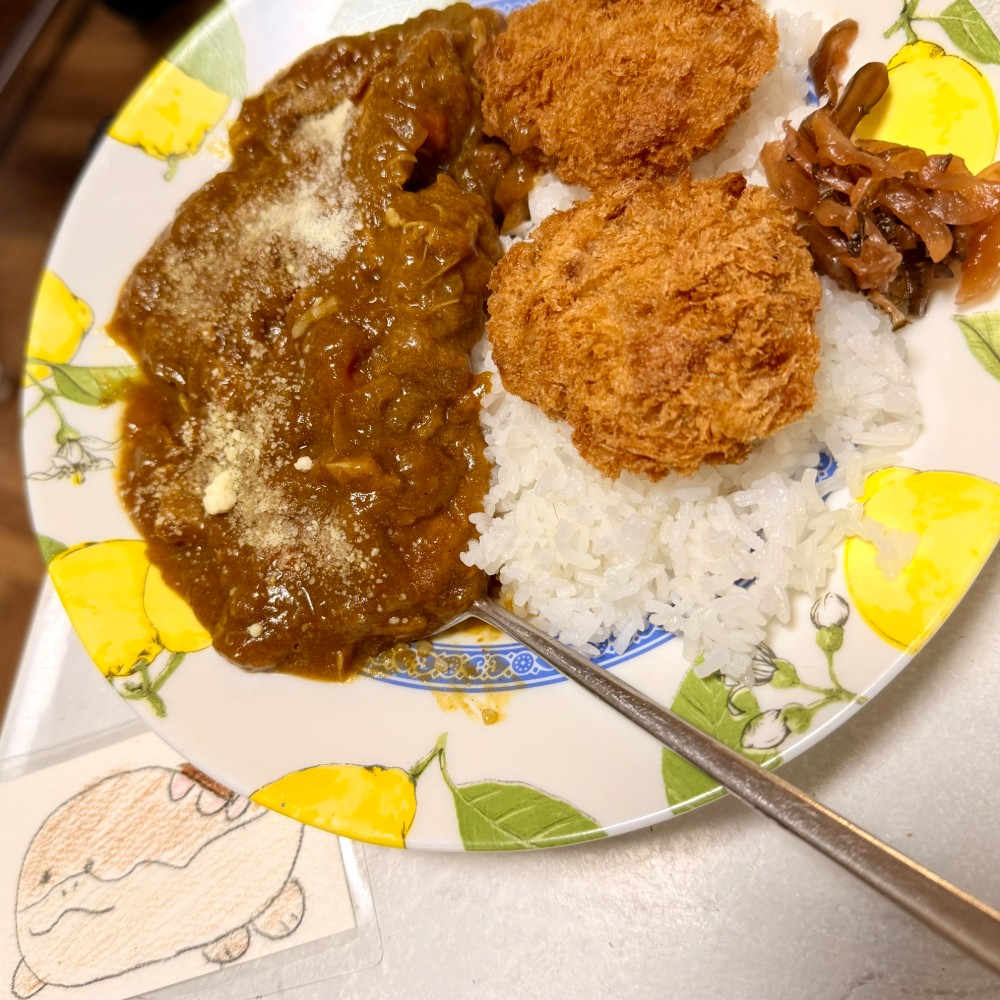
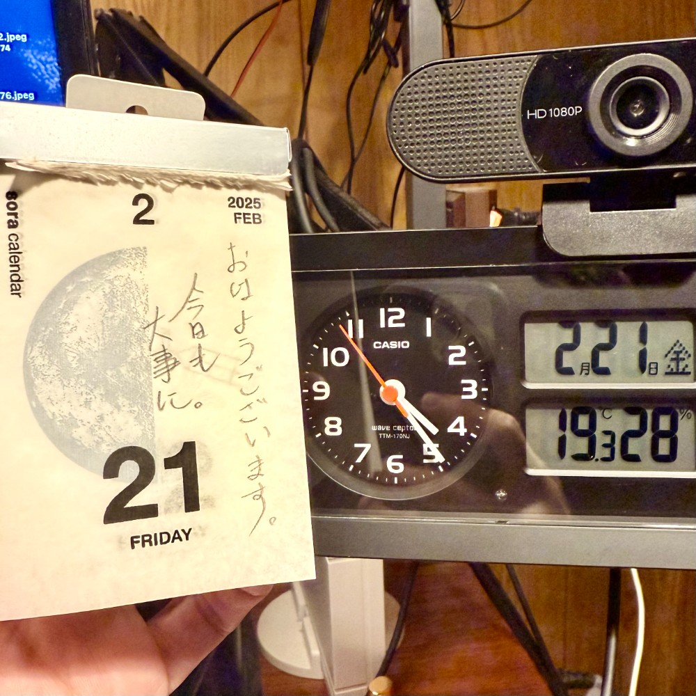

## 朝勉勤続213日目。

早朝の勉強をルーチン化してから、仕事とプライベートの切り替えが円滑になったのは、タバコを辞めたとき以来の収穫かもなぁ〜汗。家族と一緒に過ごす時間が増え、応援してくれるのは助かる。さて、今日も大事に〜

 

一次試験まであと162日

#朝勉 #朝活 #中小企業診断士試験 #日進月歩

  

\--

一世紀以前に、明治政府は貿易主権を回復させたが、保護関税を巡る議論は今もなお続く。（41句点）

 

令和7年2月21日(金)

#春秋要約 #sjyouyaku #中小企業診断士

  

  

