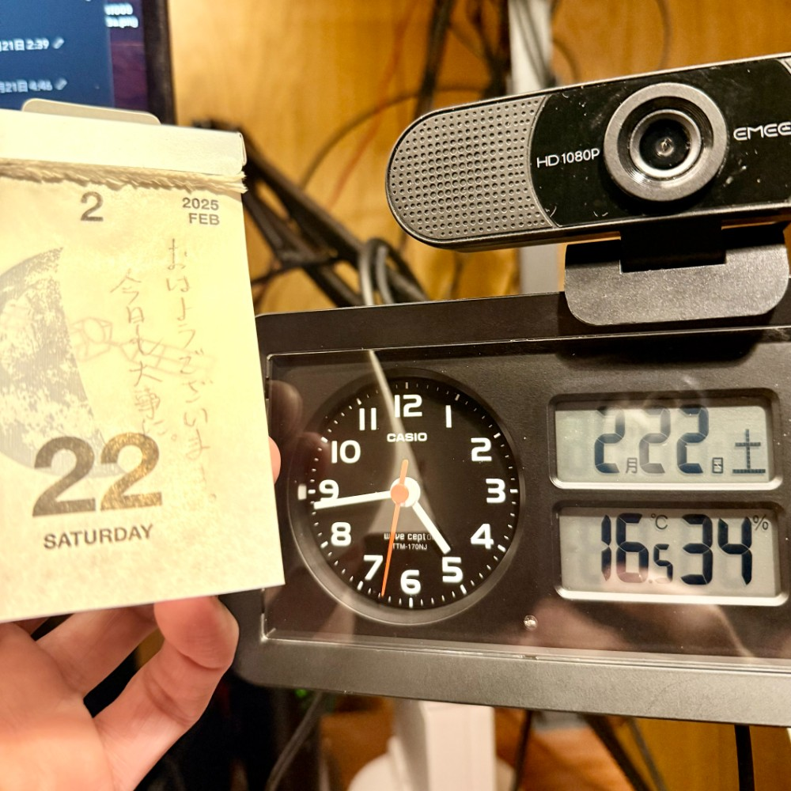

## 朝勉勤続214日目。

にゃんにゃんにゃん。土曜日は今の取引先がほとんどお休みで、子どもも部活でいないので作業に集中できる。勉強も早朝のうちに済ませて、年度末進行案件を少しでもこなさねばならぬならぬ・・・今日も大事だにゃん汗

 

一次試験まであと161日

#朝勉 #朝活 #中小企業診断士試験 #日進月歩 #猫の日

  

\--

花粉症は戦後の大量植林後の林業衰退の結果。飛散増の今季、自然との共生を考えねば。（41句点）

 

令和7年2月22日(土)

#春秋要約 #sjyouyaku #中小企業診断士

  

