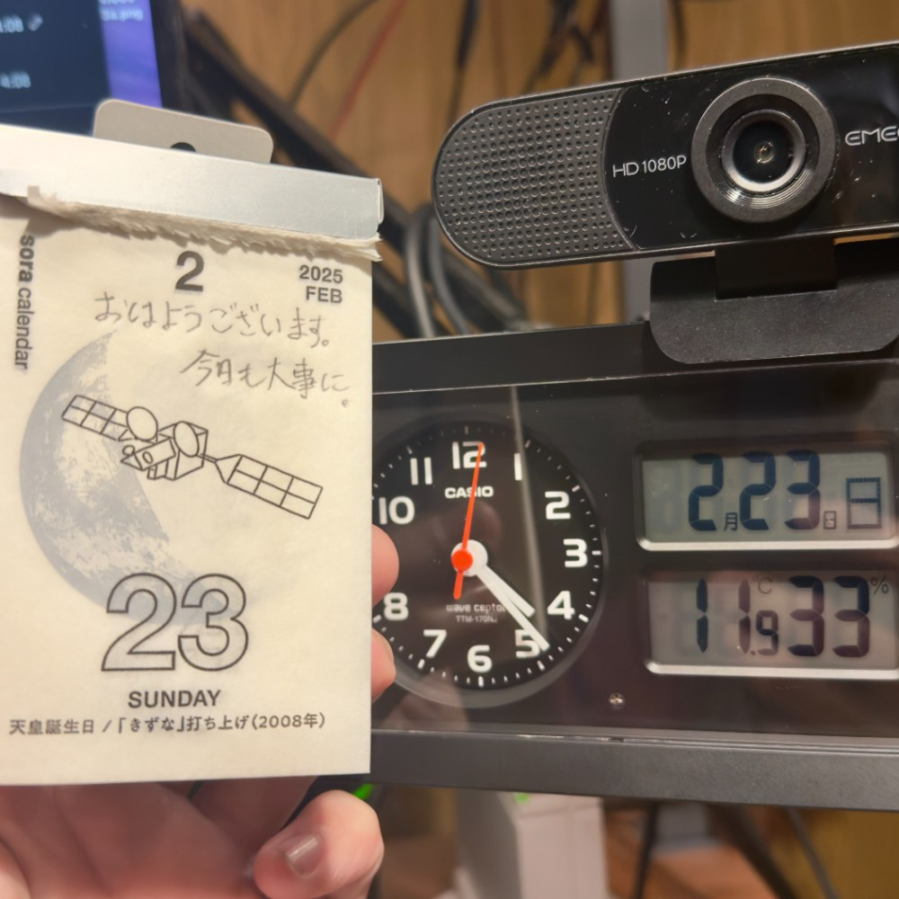

## 朝勉勤続215日目。

早寝早起きを守り、睡眠時間は約6時間半になるようにしてるけど、それで事足りてる、というか満足。昔は徹夜とかざらで24時間戦うマンして週末爆睡してたけど、やっぱトシとると規則正しいのが正義だわーいやはや汗。

 

一次試験まであと160日

#朝勉 #朝活 #中小企業診断士試験 #日進月歩

  

\--

通称「黒本」。絶望の直筆体験記が再び綴られないよう、日本は非核の訴えを強めるべき。（41句点）

 

令和7年2月23日(日)

#春秋要約 #sjyouyaku #中小企業診断士

  

  

