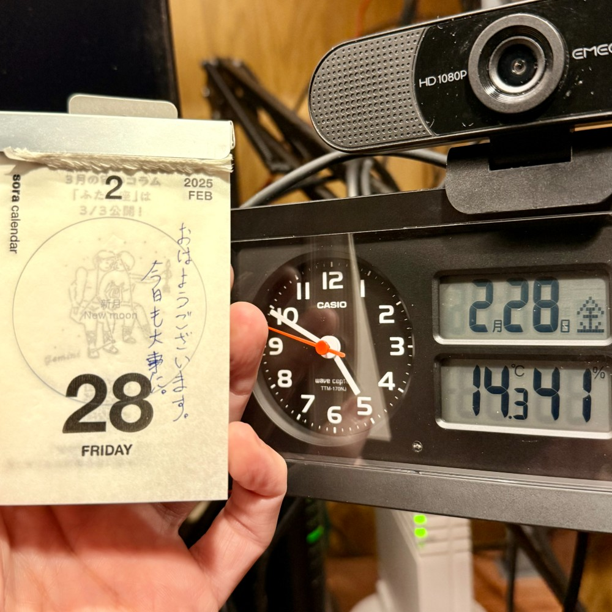

## 朝勉勤続220日目。

勉強ではChatGPT先生によくお世話になってる。「なぜその解答になるのか過程を詳しく説明してちょ」と聞くと、アホみたいに丁寧に教えてくれるし、何度同じ事を聞いても怒られないのが、バカにはありがたい〜（汗

 

一次試験まであと155日

#朝勉 #朝活 #中小企業診断士試験 #温故知新

  

\--

ロシア批判を避ける米大統領だが「侵略はなかった」と言い出しかねない危うさを感じる。（41句点）

 

令和7年2月28日(金)

#春秋要約 #sjyouyaku #中小企業診断士

