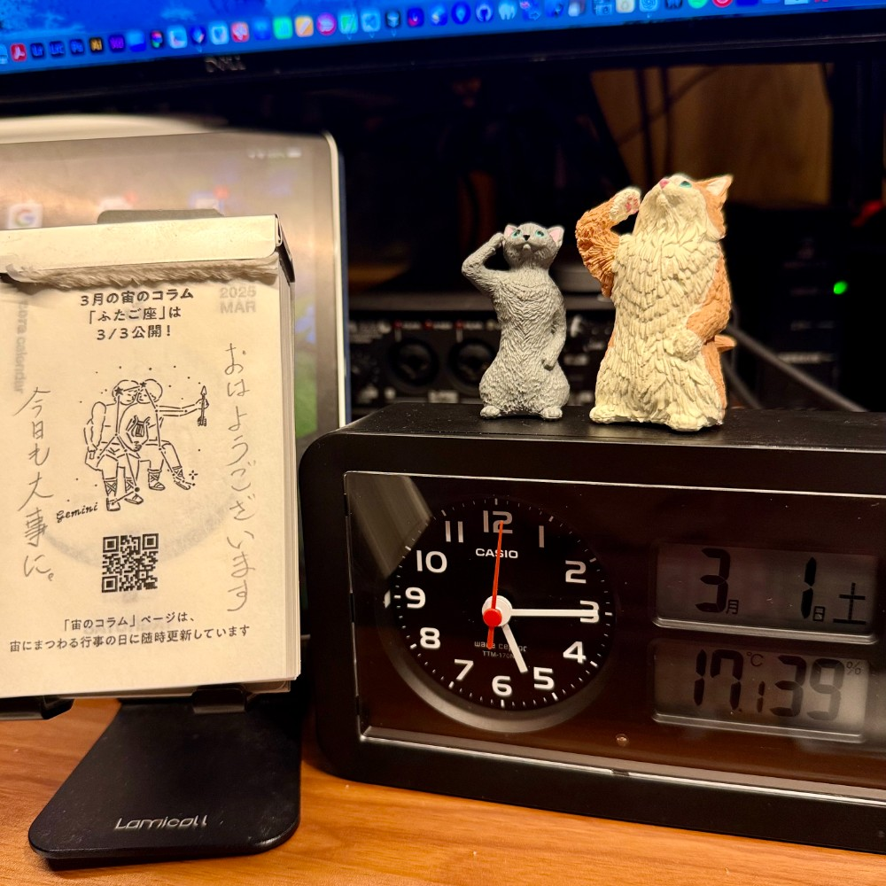

## 朝勉勤続221日目。

昨晩は22時に就寝し、仕事の関係で2時から起きっぱなしだが、まだ眠くないし子供らはブラバンの遠征なので、今から勉強を始めて昼食後に仮眠するつもり。いよいよ草木芽吹く年度末本番！気合い入れてこっと〜

 

一次試験まであと154日

#朝勉 #朝活 #中小企業診断士試験 #温故知新

  

\--

岩手での大規模森林火災も地球温暖化の影響か。人類の知恵と技術で命を守るべきと思う。（41句点）

 

令和7年3月1日(土)

#春秋要約 #sjyouyaku #中小企業診断士

  

 

  

 