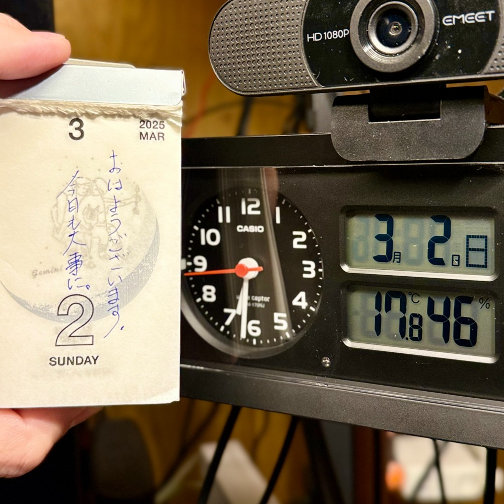

## 朝勉勤続222日目。

なんだかメランコリックな木の芽雨。ラジオ体操は軒先で早々に済ませ、珈琲淹れて新聞読むチルタイム。今日も子供らは地元のひな祭りイベントに参加するらしいので、じっくり勉強と仕事の納品の準備やっていくー

 

一次試験まであと153日

#朝勉 #朝活 #中小企業診断士試験 #温故知新

  

\--

双葉町内で除染土再利用の決断を迫られ、住民は戦時の土地収用に続き国策に翻弄される。（41句点）

 

令和7年3月2日(日)

#春秋要約 #sjyouyaku #中小企業診断士

  

  

